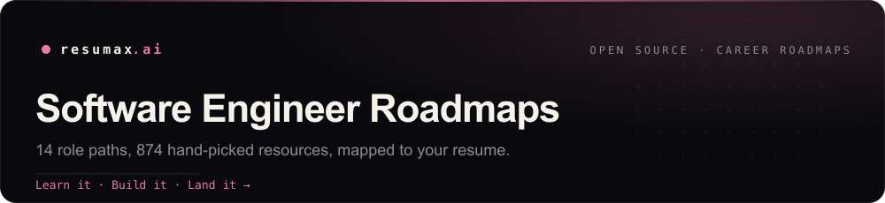

  

# Software Engineer Roadmaps

Hi, I'm **Erik Cupsa**, ex-Amazon engineer, CTO of Meuze, and the creator behind **SWErikCodes** (YouTube, TikTok, Instagram). These are the roadmaps I wish I'd had starting out: 14 role paths for software engineers, 390 skills with 874 hand-picked resources, distilled from years shipping code and building teams.

**This is open source, and it's better with more brains on it.** Know a sharper resource or a step that's missing? Add your knowledge: open an [issue](../../issues/new) or send a pull request.

  

> **The loop:** **learn the roadmap** &rarr; [build a project to prove the skill](https://github.com/resumax/coding-project-ideas) &rarr; [apply to open roles](https://github.com/resumax/new-grad-tech-jobs) &rarr; tailor your resume with the [Atlas coach](https://resumax.ai/?utm_source=github&utm_medium=repo&utm_campaign=software-engineer-roadmaps&utm_content=intro). This repo is the learn step.

## Roadmaps

| Role | Stages | Skills | Resources | |
|---|--:|--:|--:|---|
| **[New Grad SWE](./roadmaps/new-grad-software-engineer.md)** | 7 | 26 | 52 | [Personalize &rarr;](https://resumax.ai/path?role=new-grad-software-engineer&utm_source=github&utm_medium=repo&utm_campaign=software-engineer-roadmaps&utm_content=new-grad-software-engineer) |
| **[Frontend](./roadmaps/frontend-engineer.md)** | 8 | 31 | 65 | [Personalize &rarr;](https://resumax.ai/path?role=frontend-engineer&utm_source=github&utm_medium=repo&utm_campaign=software-engineer-roadmaps&utm_content=frontend-engineer) |
| **[Backend](./roadmaps/backend-engineer.md)** | 9 | 32 | 77 | [Personalize &rarr;](https://resumax.ai/path?role=backend-engineer&utm_source=github&utm_medium=repo&utm_campaign=software-engineer-roadmaps&utm_content=backend-engineer) |
| **[Full-Stack](./roadmaps/full-stack-engineer.md)** | 10 | 31 | 76 | [Personalize &rarr;](https://resumax.ai/path?role=full-stack-engineer&utm_source=github&utm_medium=repo&utm_campaign=software-engineer-roadmaps&utm_content=full-stack-engineer) |
| **[DevOps / SRE](./roadmaps/devops-sre.md)** | 7 | 29 | 73 | [Personalize &rarr;](https://resumax.ai/path?role=devops-sre&utm_source=github&utm_medium=repo&utm_campaign=software-engineer-roadmaps&utm_content=devops-sre) |
| **[Cloud](./roadmaps/cloud-engineer.md)** | 8 | 20 | 51 | [Personalize &rarr;](https://resumax.ai/path?role=cloud-engineer&utm_source=github&utm_medium=repo&utm_campaign=software-engineer-roadmaps&utm_content=cloud-engineer) |
| **[Mobile](./roadmaps/mobile-engineer.md)** | 9 | 30 | 67 | [Personalize &rarr;](https://resumax.ai/path?role=mobile-engineer&utm_source=github&utm_medium=repo&utm_campaign=software-engineer-roadmaps&utm_content=mobile-engineer) |
| **[Data Engineering](./roadmaps/data-engineer.md)** | 6 | 21 | 45 | [Personalize &rarr;](https://resumax.ai/path?role=data-engineer&utm_source=github&utm_medium=repo&utm_campaign=software-engineer-roadmaps&utm_content=data-engineer) |
| **[ML / AI](./roadmaps/ml-ai-engineer.md)** | 7 | 33 | 75 | [Personalize &rarr;](https://resumax.ai/path?role=ml-ai-engineer&utm_source=github&utm_medium=repo&utm_campaign=software-engineer-roadmaps&utm_content=ml-ai-engineer) |
| **[Data Science](./roadmaps/data-scientist.md)** | 6 | 24 | 49 | [Personalize &rarr;](https://resumax.ai/path?role=data-scientist&utm_source=github&utm_medium=repo&utm_campaign=software-engineer-roadmaps&utm_content=data-scientist) |
| **[Security](./roadmaps/security-engineer.md)** | 6 | 30 | 72 | [Personalize &rarr;](https://resumax.ai/path?role=security-engineer&utm_source=github&utm_medium=repo&utm_campaign=software-engineer-roadmaps&utm_content=security-engineer) |
| **[QA / SDET](./roadmaps/qa-sdet.md)** | 6 | 23 | 55 | [Personalize &rarr;](https://resumax.ai/path?role=qa-sdet&utm_source=github&utm_medium=repo&utm_campaign=software-engineer-roadmaps&utm_content=qa-sdet) |
| **[Embedded](./roadmaps/embedded-systems.md)** | 10 | 38 | 76 | [Personalize &rarr;](https://resumax.ai/path?role=embedded-systems&utm_source=github&utm_medium=repo&utm_campaign=software-engineer-roadmaps&utm_content=embedded-systems) |
| **[Game Dev](./roadmaps/game-developer.md)** | 5 | 22 | 41 | [Personalize &rarr;](https://resumax.ai/path?role=game-developer&utm_source=github&utm_medium=repo&utm_campaign=software-engineer-roadmaps&utm_content=game-developer) |

Open a roadmap for its full stages, skills, and resources. "Personalize" maps the path to your resume on ResuMax.

---

### Part of the open-source ResuMax stack

**Roadmaps** to learn it (you are here) &nbsp;·&nbsp; [**Projects**](https://github.com/resumax/coding-project-ideas) to prove it &nbsp;·&nbsp; [**Jobs**](https://github.com/resumax/new-grad-tech-jobs) to land it &nbsp;·&nbsp; [**Internships**](https://github.com/resumax/tech-internships) to break in

Built by **[ResuMax](https://resumax.ai/?utm_source=github&utm_medium=repo&utm_campaign=software-engineer-roadmaps)**, the AI career platform for software engineers. Learn the path, build the proof, land the role, and tailor your resume with the Atlas coach.

This list is generated automatically from ResuMax's open data and refreshed on a schedule. Found an issue? Open an issue or PR.
